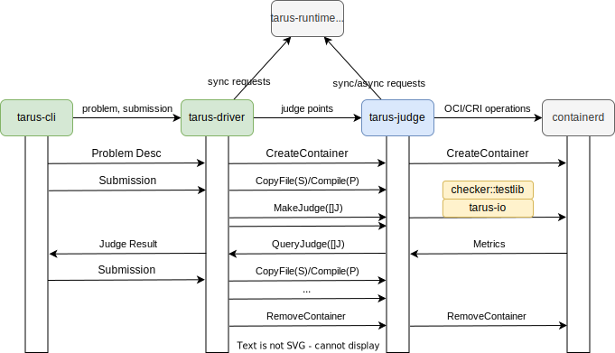
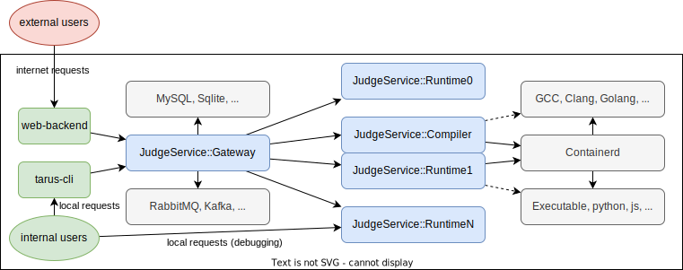

## Tarus

Online Judge Engine Powered by runC, gVisor and other execution runtime.

## Take a glance

The only prerequisite is downloading and run [containerd](https://containerd.io/downloads/), which works on distribution
of any Linux or WSL.

```shell
$ containerd # run containerd service
INFO[2022-03-31T03:38:38.222472900+08:00] starting containerd                           revision=10f428dac7cec44c864e1b830a4623af27a9fc70 version=v1.6.1
...
INFO[2022-03-31T03:38:38.243084903+08:00] serving...                                    address=/run/containerd/containerd.sock.ttrpc
INFO[2022-03-31T03:38:38.243109172+08:00] Start recovering state
INFO[2022-03-31T03:38:38.243127039+08:00] serving...                                    address=/run/containerd/containerd.sock
INFO[2022-03-31T03:38:38.243172865+08:00] containerd successfully booted in 0.021098s
INFO[2022-03-31T03:38:38.253966164+08:00] Start event monitor
INFO[2022-03-31T03:38:38.254040667+08:00] Start snapshots syncer
INFO[2022-03-31T03:38:38.254070786+08:00] Start cni network conf syncer for default
INFO[2022-03-31T03:38:38.254096571+08:00] Start streaming server
$ git clone https://github.com/Myriad-Dreamin/tarus
$ cd tarus
$ go run ./cmd/tarus # run tarus service
$ go run ./cmd/tarus-cli submit --driver domjudge,problem=fuzzers/corpora/domjudge/bapc2019-A \
   submission=fuzzers/corpora/domjudge/bapc2019-A/submissions/accepted/nicky.cpp # run tarus client, served by tarus daemon
Response: []tarus_app.JudgeResult{
  tarus_app.JudgeResult{
    Index:  "0:AAA",
    Status: "Accepted/0s/16ms/5.270MB",
  },
  tarus_app.JudgeResult{
    Index:  "1:AQA",
    Status: "Accepted/0s/21ms/3.977MB",
  },
  tarus_app.JudgeResult{
    Index:  "2:AgA",
    Status: "Accepted/130ms/153ms/12.766MB",
  },
  ...
  tarus_app.JudgeResult{
    Index:  "31:HwA",
    Status: "Accepted/150ms/191ms/9.469MB",
  },
}
$ go run ./cmd/tarus-cli submit --integrated-service oci:containerd --driver domjudge,problem=fuzzers/corpora/domjudge/bapc2019-A \
   submission=fuzzers/corpora/domjudge/bapc2019-A/submissions/accepted/nicky.cpp # embedded tarus service 
Response: []tarus_app.JudgeResult{
  tarus_app.JudgeResult{
    Index:  "0:AAA",
    Status: "Accepted/0s/10ms/6.205MB",
  },
  ...
}
```

## Design

The Judge Service is defined in GRPC Service, hence both embedded service and remote service are supported. And, the
OCI Standard has been implemented as a tarus judge service (runtime), so most oci-runtime are soon available in this
framework, including [runC](https://github.com/opencontainers/runc), [gVisor](https://github.com/google/gvisor) and
[Kata Containers](https://github.com/kata-containers/kata-containers).



Also, the judge proxy service such as [Kafka Gateway](https://github.com/apache/kafka) is on the way, which can connect
multiple judge runtime services and provides more functionality for users.

```protobuf
service JudgeService::Runtime { // minimum implementation
  rpc Handshake(HandshakeRequest) returns (HandshakeResponse);
  rpc CreateContainer(CreateContainerRequest) returns (google.protobuf.Empty);
  rpc RemoveContainer(RemoveContainerRequest) returns (google.protobuf.Empty);
  rpc CopyFile(CopyRequest) returns (google.protobuf.Empty);
  rpc MakeJudge(MakeJudgeRequest) returns (MakeJudgeResponse);
}

service JudgeService::Compiler { // compiler implementation
  rpc Handshake(HandshakeRequest) returns (HandshakeResponse);
  rpc CreateContainer(CreateContainerRequest) returns (google.protobuf.Empty);
  rpc RemoveContainer(RemoveContainerRequest) returns (google.protobuf.Empty);
  rpc CopyFile(CopyFileRequest) returns (google.protobuf.Empty);
  rpc CompileProgram(CompileProgramRequest) returns (google.protobuf.Empty);
}

service JudgeService::Async { // async service implementation
  JudgeService::Runtime

  rpc QueryJudge(QueryJudgeRequest) returns (QueryJudgeResponse);
}
service JudgeService::Gateway { // service aggregator
  JudgeService::Minimum
  JudgeService::Compiler
  JudgeService::Async
}
```




